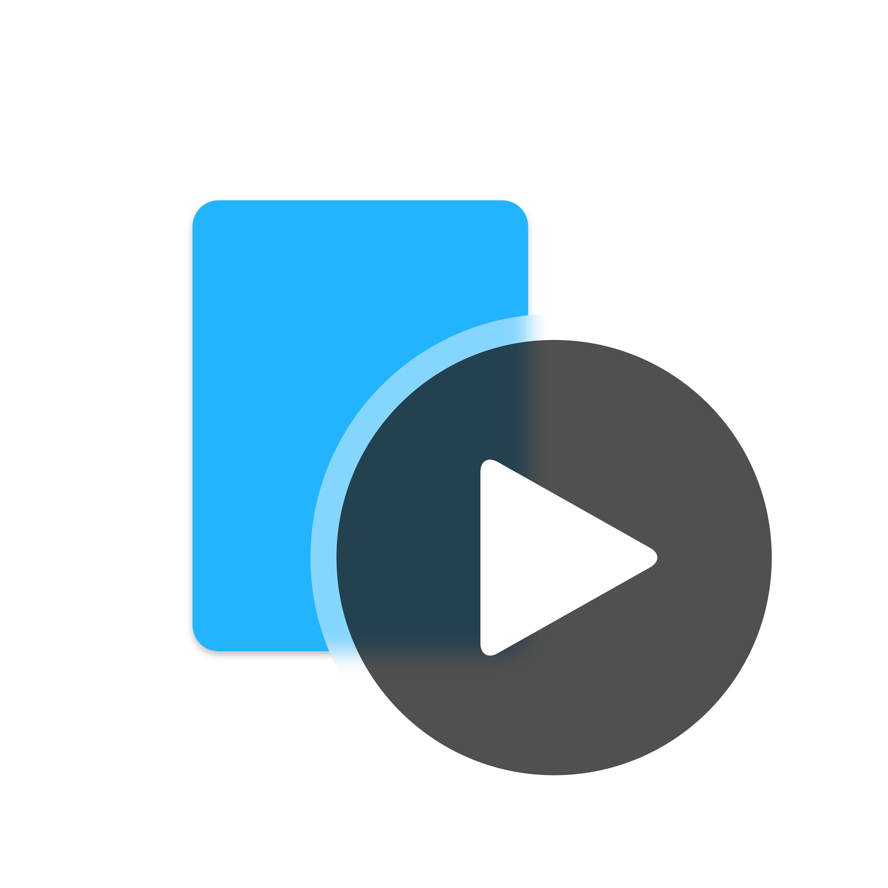

# NonsPlayer (Next-Gen)

**极致轻量 | 全平台支持 | 极度自定义 | 沉浸式听歌体验**

---

> ⚠️ **项目状态公告 (WIP)**
> 
> NonsPlayer 目前正在经历一次**底层重构**。为了实现真正的跨平台与极致的性能，我们正从旧版框架全面迁移至 `Svelte + Tauri` 架构。
> **当前状态：** 架构设计与早期开发阶段（新建文件夹 ）。所有功能正在积极敲代码中，敬请期待！

## ✨ 核心愿景 & 计划特性

新一代的 NonsPlayer 旨在成为一个**不受平台限制、完全由你掌控**的音乐枢纽。

- 🌍 **真正的全平台支持：** 将脱离仅限Windows的头衔，全面拥抱Windows + macOS + Linux 全平台
- 🧩 **突破极限的自定义 (重点开发中)：**
  - **核心插件系统：** 深度开放的 API，自由获取与修改播放器状态。
  - **多源适配器：** 自由扩展音乐源（本地音乐、NAS、各大在线音乐平台）。
  - **视觉自定义 (WIP/探索中)：** 未来计划开放 UI 套件与歌词界面的深度定制，打造专属于你的播放器。
- 🎵 **沉浸式视听：** 标志性的类似 Apple Music 的唯美歌词展示系统。

## 🗺️ 开发路线图 (Roadmap)

在这里见证 NonsPlayer 的成长轨迹：

- [x] **Phase 0:** 新建文件夹 
- [ ] **Phase 1: 基础设施构建**...

## 📦️ 下载与体验

*由于项目正在重构初期，暂未提供基于新架构的编译版本。*

如果你想体验**基于旧版架构**的 NonsPlayer，请访问 [旧版 Latest Release](https://github.com/Miaoywww/NeteaseCloudMusicControl/releases)。
*(注：旧版仅支持 Windows，且需要 .NET 8.0 Desktop Runtime 及特定适配器)*

## 💬 和开发者交流

欢迎加入我们的交流空间，一起见证新一代 NonsPlayer 的诞生，或参与技术吹水！

- **QQ群：** [点击加入](https://qm.qq.com/q/iqCKFZ12ZG)

## 💡 灵感来源

本项目的诞生离不开以下优秀产品的启发：
- [YesPlayMusic](https://github.com/qier222/YesPlayMusic)

## 🙏 特别鸣谢

- **[Zhuym](https://github.com/Zhuym07), [GooGuJiang](https://github.com/GooGuJiang)** - 为图标与 UI 设计提供重要帮助。
- **[NeteaseCloudMusicApi](https://github.com/Binaryify/NeteaseCloudMusicApi)**
- **[Apple Music-like Lyrics](https://github.com/Steve-xmh/applemusic-like-lyrics)**
- **[amll-ttml-db](https://github.com/Steve-xmh/amll-ttml-db)**

**视觉与字体资源：**
- [HarmonyOS Sans SC](https://developer.huawei.com/consumer/cn/doc/design-guides-V1/font-0000001157868583-V1)
- Novecento Wide Bold

## 📜 开源许可

Copyright Miaoyww 2022-2026.

Distributed under the terms of the [GPL-3.0 license](https://github.com/Miaoywww/NeteaseCloudMusicControl/blob/master/LICENSE.txt).
