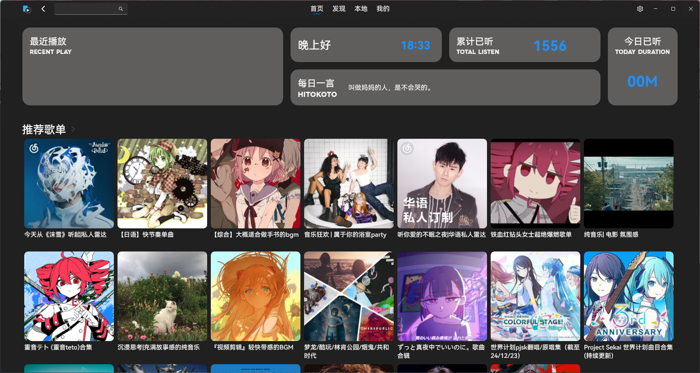
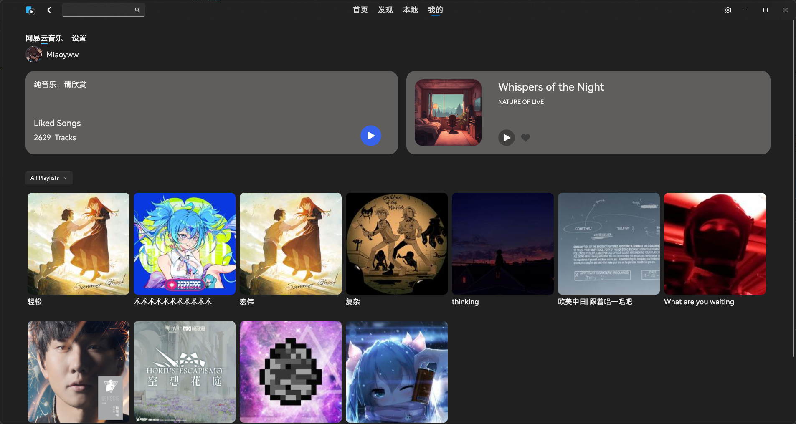
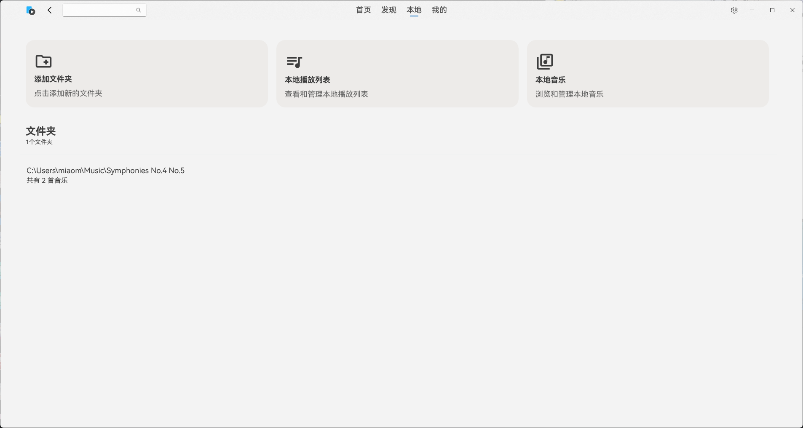
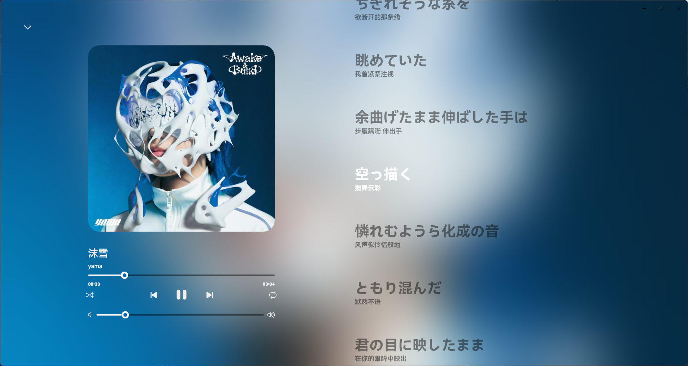

<!---->

# NonsPlayer

高性能 | 多音乐平台 | 支持本地音乐 | 支持插件

***

# ⭐亮点

- 高开放的API接口, 可以获取 / 修改播放器状态
- 可播放多平台音乐 / 本地音乐 / NAS音乐
- 似Apple Music的歌词显示
- 可供扩展的插件系统
- 可扩展的音乐源
- 界面美观, 操作简单
- 低占用

# 📦️下载

打开 [Latest Release](https://github.com/Miaoywww/NeteaseCloudMusicControl/releases) 页面, 下载最新版本,并解压

找到 `NonsPlayer.exe` 文件, 打开它即可！

**需要[.net8.0 Desktop Runtime](https://dotnet.microsoft.com/zh-cn/download/dotnet/8.0)**

**需要适配器, 目前仅有[网易云音乐](https://github.com/Miaoyww/NonsAdapter-Ncmp)可用**

**Windows 10版本需要额外下载[Fluent Icons](https://learn.microsoft.com/zh-cn/windows/apps/design/downloads/#fonts)字体库**

# 和开发者交流🎉

欢迎加入我们的交流空间！

技术|开发|吹水: [QQ群](https://qm.qq.com/q/YMcwgNJB2a)

# 💡灵感来源

- [Spotify](https://www.spotify.com/)
- [Apple Music](https://music.apple.com)
- [YesPlayMusic](https://github.com/qier222/YesPlayMusic)
- [网易云音乐](https://music.163.com/)
- [QQ音乐](https://y.qq.com/)

# 特别鸣谢

- [Zhuym](https://github.com/Zhuym07), [GooGuJiang](https://github.com/GooGuJiang) 为图标设计、UI设计提供帮助
- [NeteaseCloudMusicApi](https://github.com/Binaryify/NeteaseCloudMusicApi)
- [Apple Music-like Lyrics](https://github.com/Steve-xmh/applemusic-like-lyrics)
- [amll-ttml-db](https://github.com/Steve-xmh/amll-ttml-db)
- [material-design-icons](https://github.com/google/material-design-icons)

# 资源使用

## 字体
[HarmonyOS Sans SC](https://developer.huawei.com/consumer/cn/doc/design-guides-V1/font-0000001157868583-V1)

Novecento Wide Bold

# 🖼️应用截图
**仍在开发中，并不代表最终质量**

# 📜开源许可

Copyright Miaoyww 2022-2024.

Distributed under the terms of
the [GPL-3.0 license](https://github.com/Miaoywww/NeteaseCloudMusicControl/blob/master/LICENSE.txt).

<image src="https://resources.jetbrains.com/storage/products/company/brand/logos/jb_beam.svg"></image>

特别感谢 <a href=https://jb.gg/OpenSourceSupport>JetBrains</a> 为本项目提供的大力支持

